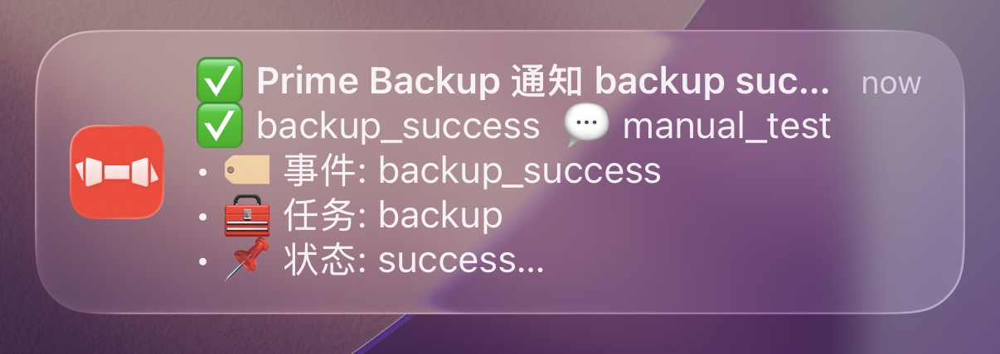
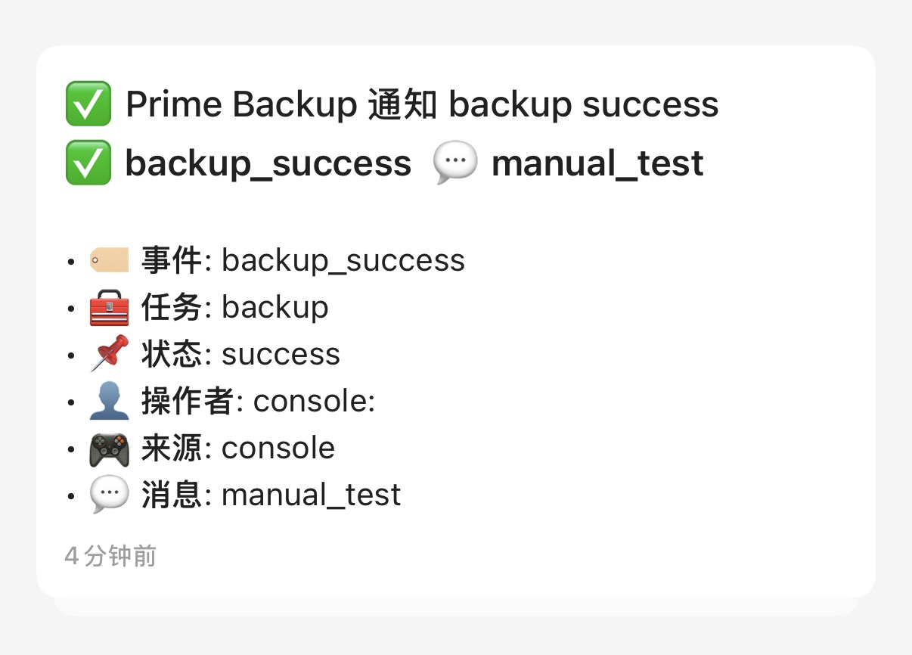

# Prime Backup Notify

**English** | [中文](README.zh.md)

A powerful backup plugin for MCDR, an advanced backup solution for your Minecraft world

**Modified from original [Prime Backup](https://github.com/TISUnion/PrimeBackup) with task notification features**

Original Author: [Fallen_Breath](https://github.com/Fallen-Breath)  
Modified By: [colorcard](https://github.com/colorcard)  
License: LGPL v3

Document: https://colorcard.github.io/PrimeBackupNotify/

## New Features (Compared to Original Prime Backup)

- **Task Notifications**: Push notifications when backup/restore tasks start, succeed, or fail
- **Webhook Support**: Configure multiple webhook endpoints with JSON payload
- **Native Bark Support**: Direct push to Bark without relay webhook (supports URL placeholders, custom levels and message formatting)
- **Ops-Friendly**: Bark messages include key fields (backup ID, cost, errors) by default, with automatic severity level mapping
- **Command-line Testing**: New `!!pb test notify` command for quick notification testing
- **Complete Documentation**: Bilingual (EN/ZH) notification docs and config examples

## Original Features

- Only stores files with changes with the hash-based file pool. Supports unlimited number of backup
- Comprehensive backup operations, including backup/restore, list/delete, import/export, etc
- Smooth in-game interaction, with most operations achievable through mouse clicks
- Highly customizable backup pruning strategies, similar to the strategy use by [PBS](https://pbs.proxmox.com/docs/prune-simulator/)
- Crontab jobs, including automatic backup, automatic pruning, etc.
- Supports use as a command-line tool. Manage the backups without MCDR

## Requirements

[MCDReforged](https://github.com/Fallen-Breath/MCDReforged) requirement: `>=2.12.0`

Python package requirements: See [requirements.txt](requirements.txt)

## Usages

See the document: https://colorcard.github.io/PrimeBackupNotify/

## How it works

Prime Backup maintains a custom file pool to store the backup files. Every file in the pool is identified with the hash value of its content.
With that, Prime Backup can deduplicate files with same content, and only stores 1 copy of them, greatly reduces the burden on disk usage. 

Besides that, Prime Backup also supports compression on the stored files, which reduces the disk usage further more

PrimeBackup is capable of storing various of common file types, including regular files, directories, and symbolic links. For these 3 types:

- Regular file: Prime Backup calculates its hash values first. If the hash does not exist in the file pool, 
  Prime backup will (compress and) store its content into a new blob in the file pool.
  The file status, including mode, uid, mtime etc., will be stored in the database
- Directory: Prime Backup will store its information in the database
- Symlink: Prime Backup will store the symlink itself, instead of the linked target

## Thanks

The idea for the hash-based file pool is inspired by https://github.com/z0z0r4/better_backup
